# Remember iOS App - User Journey Map

> Document généré automatiquement à partir de l'analyse de la codebase et documentation.
> **Version:** 1.0 | **Date:** 2026-02-01

---

## 1. Vue d'ensemble - Architecture de Navigation

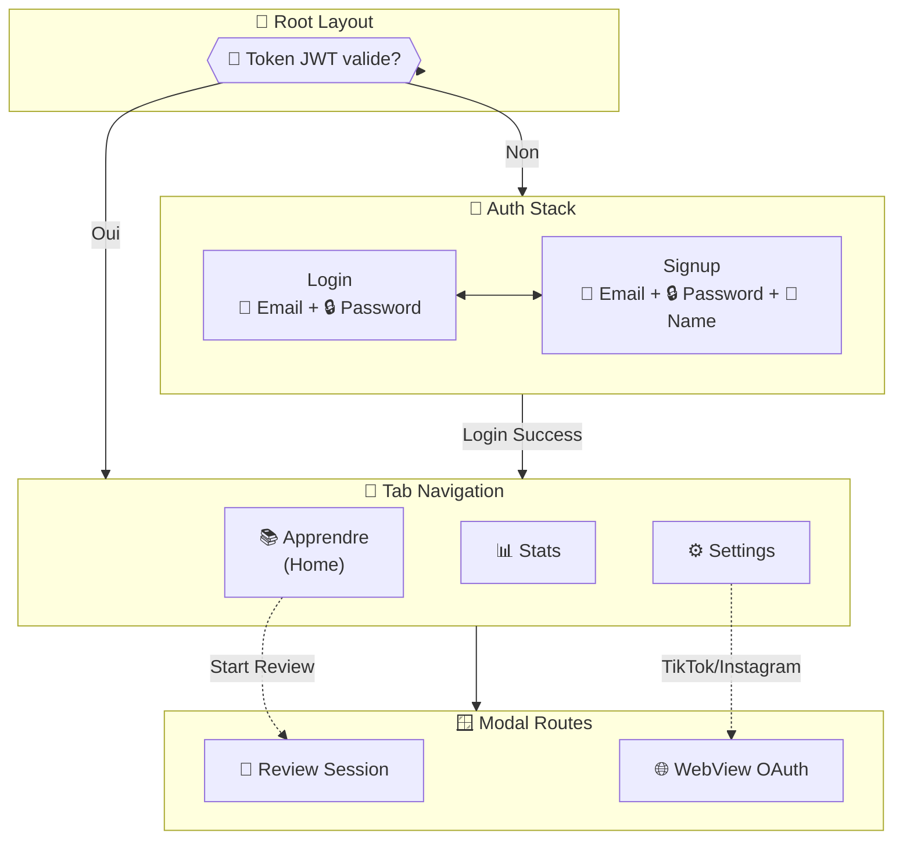

---

## 2. Flux d'Authentification Complet

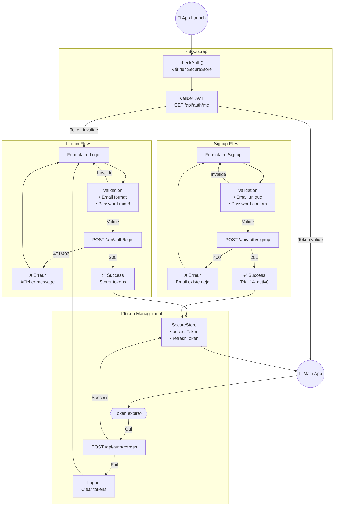

---

## 3. Connexion des Plateformes (OAuth)

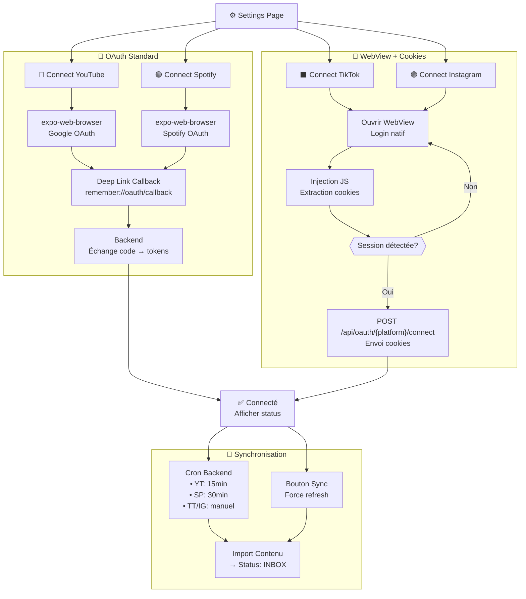

---

## 4. Cycle de Vie du Contenu

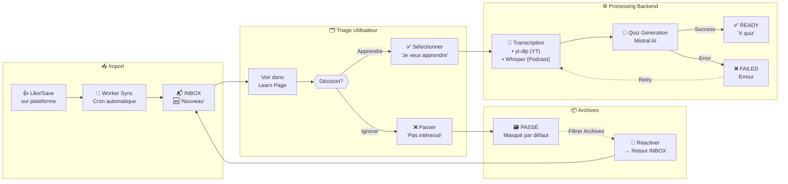

---

## 5. Parcours d'Apprentissage Principal

```mermaid
flowchart TD
    subgraph LEARN_PAGE["📚 Page Apprendre (Home)"]
        direction TB

        HEADER["🔥 Header Stats\n• Streak actuel\n• Cards dues\n• Inbox count"]

        FILTERS["🔍 Filtres\n• Plateformes\n• Tags/Thèmes\n• Actif vs Archives"]

        GRID["📦 Grille Contenu\n• Thumbnails\n• Badges status\n• Checkboxes"]

        SELECTION["☑️ Barre de Sélection\n• X sélectionnés\n• Y quiz prêts\n• Bouton Réviser"]
    end

    subgraph SESSION_BUILD["🎮 Session Builder"]
        direction TB
        CONFIG["Configuration\n• Limite questions\n• Filtres actifs"]
        PREVIEW["Aperçu\n'X cartes disponibles'"]
        LAUNCH["🚀 Lancer Session"]
    end

    subgraph REVIEW_SESSION["🎯 Review Session"]
        direction TB

        PROGRESS["📊 Progress Bar\n8/12 cartes"]

        QUESTION["❓ Question\n4 options (A-D)"]

        ANSWER_STATE{{"Réponse révélée?"}}

        SELECT_OPT["Sélectionner option\n(1-4 clavier)"]

        REVEAL["👁️ Voir Réponse\n(Space)"]

        FEEDBACK["✅/❌ Feedback\n+ Explication"]

        RATING["⭐ Rating SM-2\n• Again (1)\n• Hard (2)\n• Good (3)\n• Easy (4)"]

        NEXT_CARD["➡️ Carte suivante\nAuto-advance"]

        SESSION_END{{"Dernière carte?"}}
    end

    subgraph COMPLETE["🏆 Session Complete"]
        direction TB
        SUMMARY["📈 Résumé\n• Total cartes\n• % correct\n• Durée\n• Streak"]

        BREAKDOWN["📊 Breakdown\n• Again: X\n• Hard: X\n• Good: X\n• Easy: X"]

        ACTIONS["🎯 Actions\n• Générer Mémo IA\n• Voir Erreurs\n• Retour Learn"]
    end

    LEARN_PAGE --> SESSION_BUILD
    HEADER --> FILTERS --> GRID --> SELECTION

    SELECTION -->|"Réviser →"| CONFIG
    CONFIG --> PREVIEW --> LAUNCH

    LAUNCH --> PROGRESS
    PROGRESS --> QUESTION
    QUESTION --> SELECT_OPT
    SELECT_OPT --> ANSWER_STATE
    ANSWER_STATE -->|Non| REVEAL
    REVEAL --> FEEDBACK
    ANSWER_STATE -->|Oui| FEEDBACK
    FEEDBACK --> RATING
    RATING --> NEXT_CARD
    NEXT_CARD --> SESSION_END
    SESSION_END -->|Non| QUESTION
    SESSION_END -->|Oui| SUMMARY

    SUMMARY --> BREAKDOWN --> ACTIONS
    ACTIONS -->|"Retour"| LEARN_PAGE
```

---

## 6. Algorithme SM-2 (Spaced Repetition)

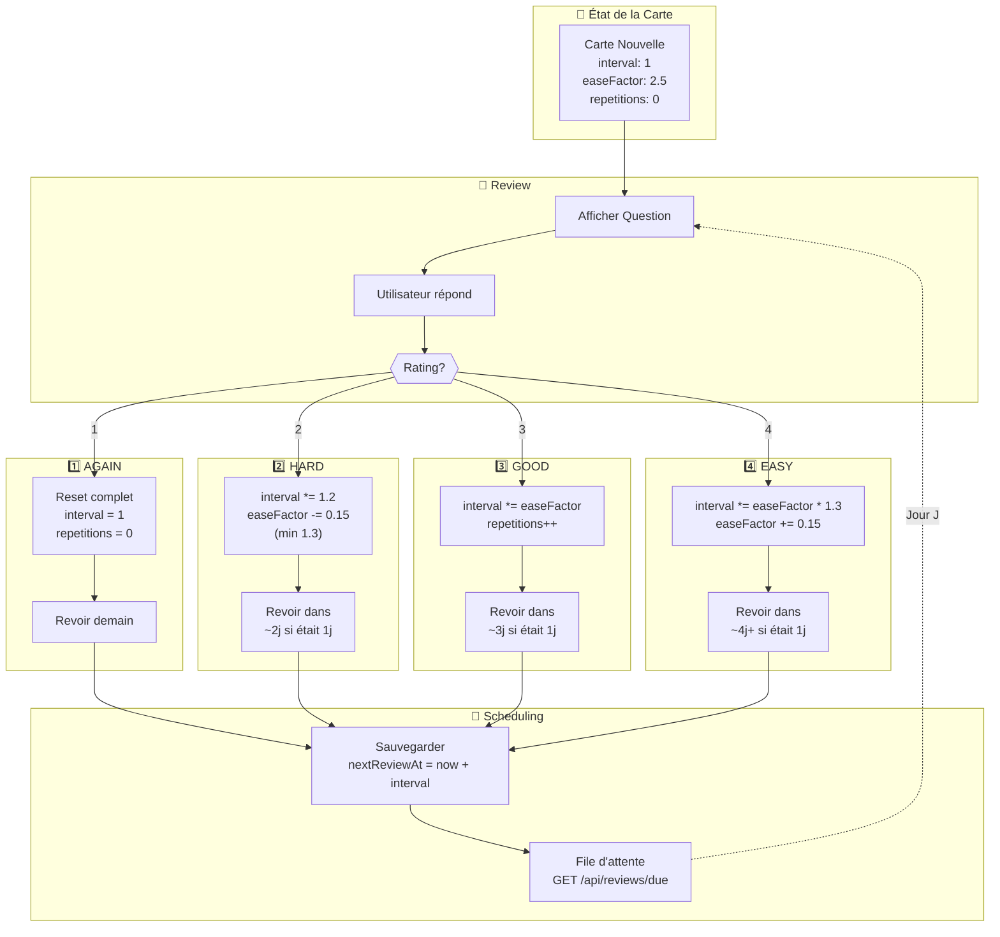

---

## 7. Dashboard Statistiques

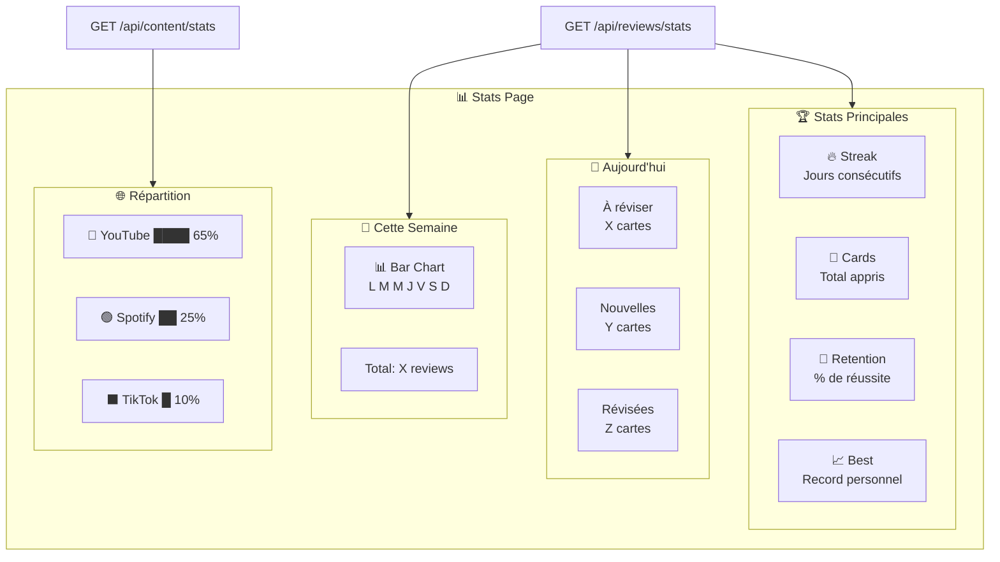

---

## 8. Gestion des Notes (Memos IA)

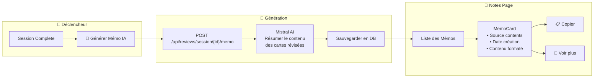

---

## 9. Parcours Complet - User Journey Map

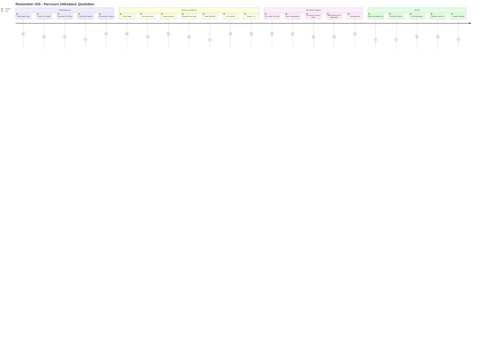

---

## 10. États des Écrans

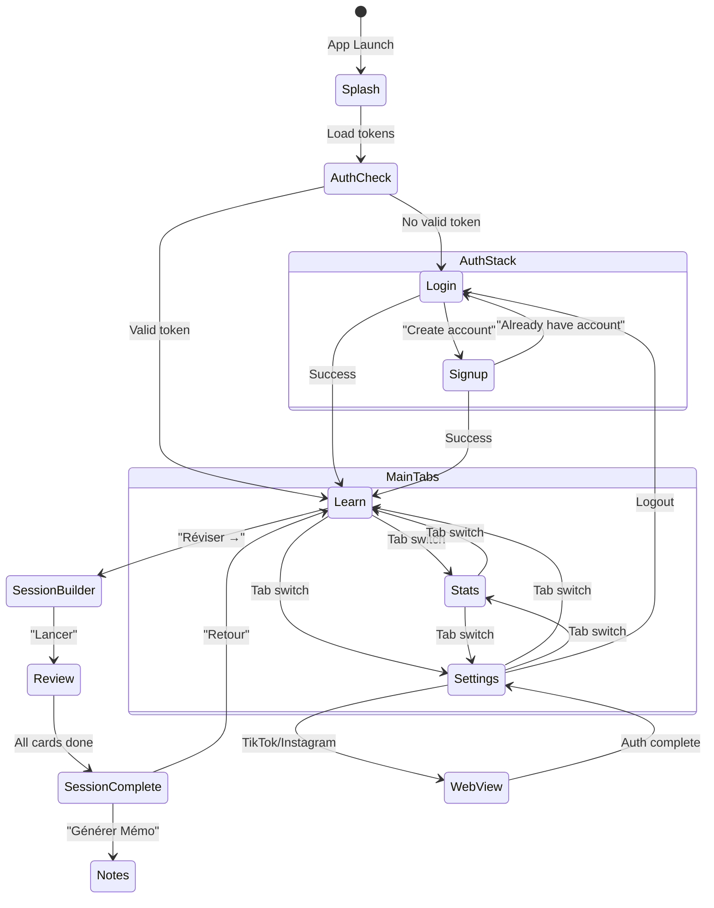

---

## 11. Flux de Données (Data Flow)

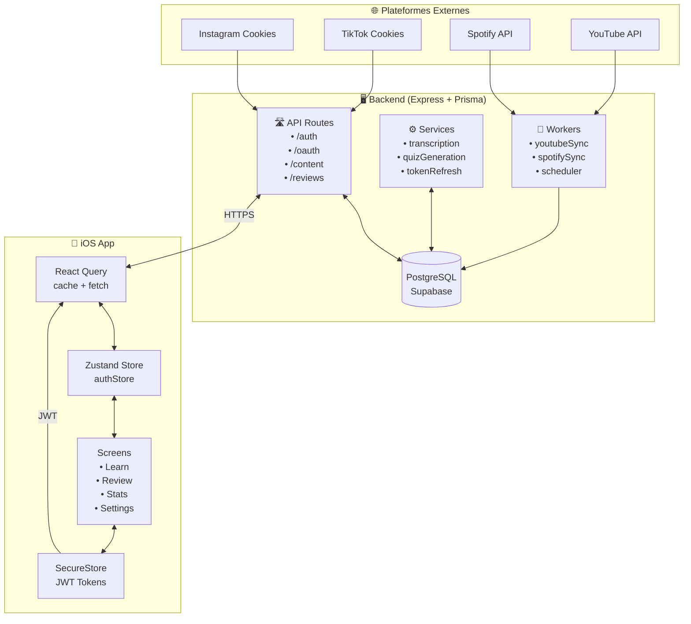

---

## 12. Résumé des Endpoints API

```mermaid
mindmap
    root((API Endpoints))
        Auth
            POST /login
            POST /signup
            POST /refresh
            GET /me
            POST /logout
        OAuth
            GET /status
            GET /{platform}/connect
            DELETE /{platform}/disconnect
            POST /{platform}/connect
            POST /{platform}/sync
            PUT /{platform}/source
        Content
            GET /
            GET /:id
            GET /inbox
            GET /tags
            POST /refresh
            PATCH /:id/triage
            POST /triage/bulk
            GET /stats
        Reviews
            GET /due
            GET /stats
            POST /
            POST /session
            GET /session/:id/cards
            GET /session/preview
            POST /session/:id/complete
            POST /session/:id/memo
            GET /memos
```

---

## Légende

| Symbole | Signification |
|---------|---------------|
| 🆕 | Nouveau contenu (INBOX) |
| ✅ | Prêt / Succès |
| ❌ | Échec / Erreur |
| 🔄 | En cours / Sync |
| 📬 | Inbox |
| 🎯 | Review / Quiz |
| 🔥 | Streak |
| 📊 | Stats |
| ⚙️ | Settings |
| 🤖 | IA (Mistral) |
| 🍪 | Cookies (WebView auth) |

---

## Notes d'implémentation

### Priorités
1. **P0 - Core Loop**: Auth → Learn → Review → Stats
2. **P1 - Platforms**: YouTube + Spotify OAuth
3. **P2 - Extra Platforms**: TikTok + Instagram WebView
4. **P3 - Polish**: Notes, Notifications, Deep Links

### Issues Linear associées
- REM-51 à REM-63: ✅ Implémentés
- REM-64: Push Notifications (TODO)
- REM-65: Deep Links (TODO)

---

*Document généré le 2026-02-01 par Claude Code*
