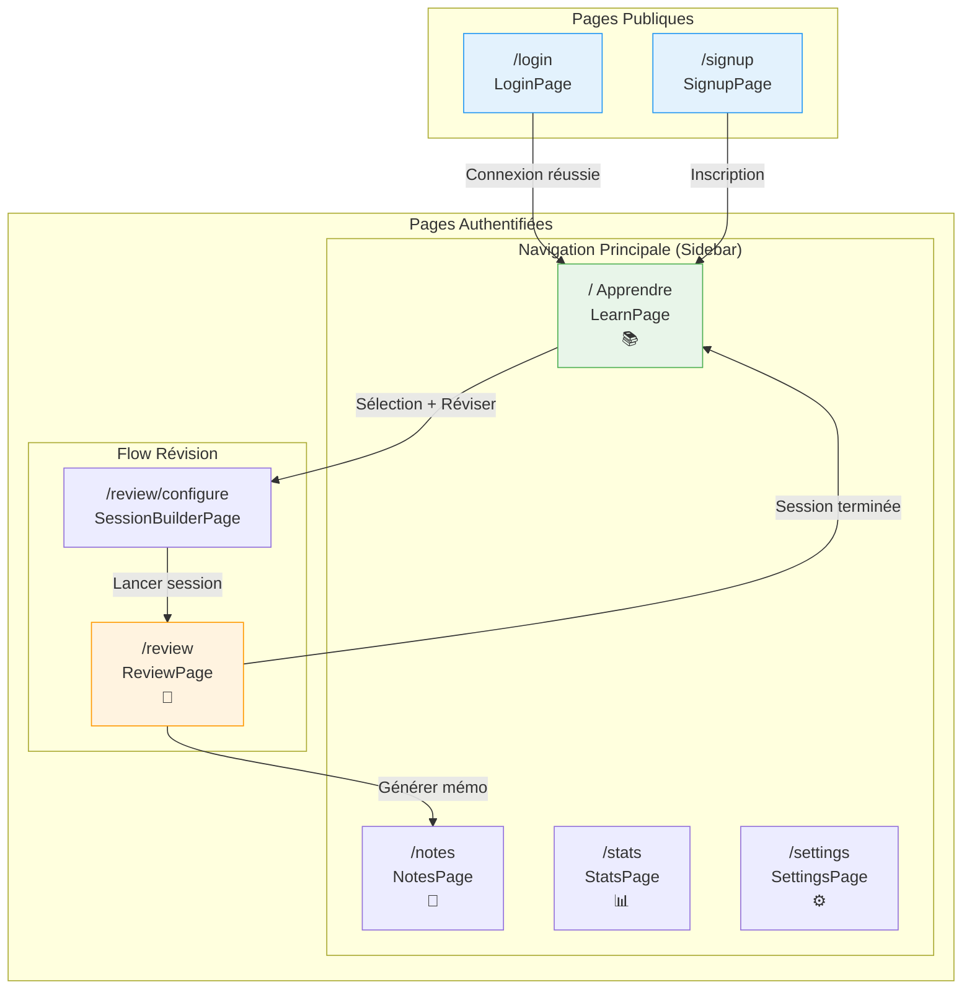
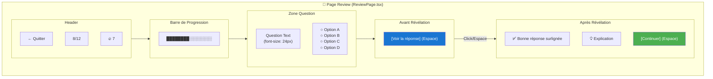
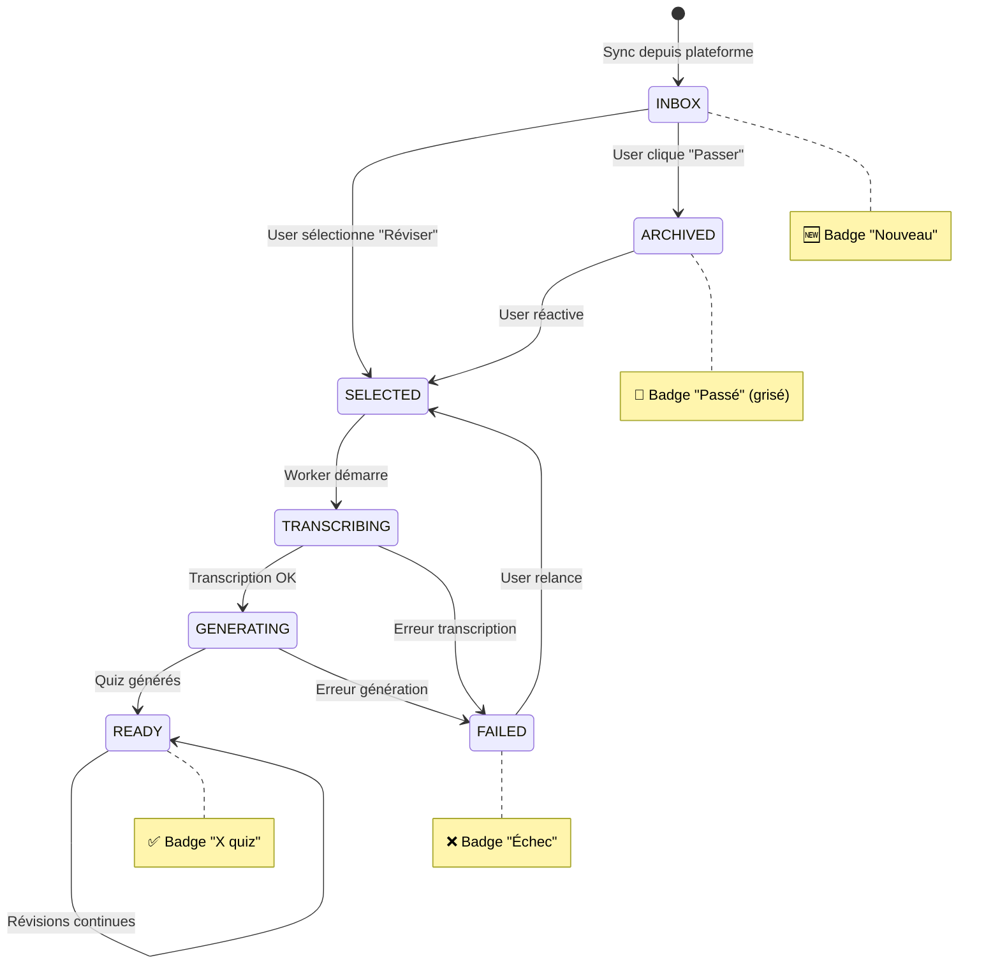
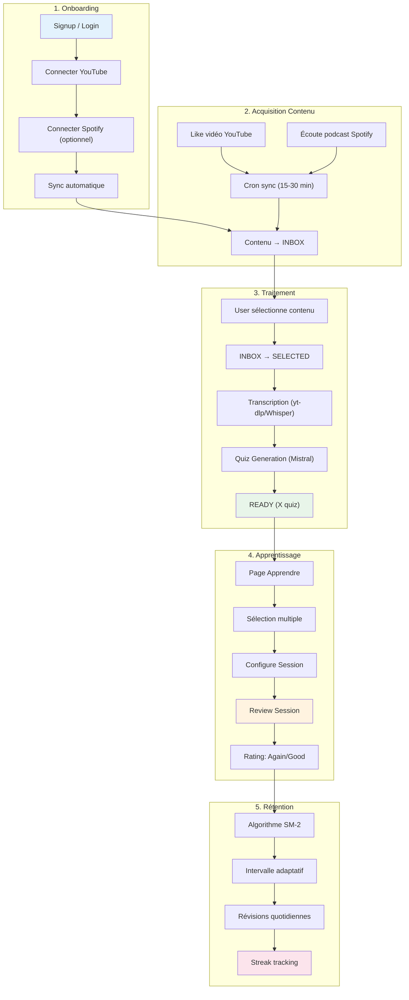
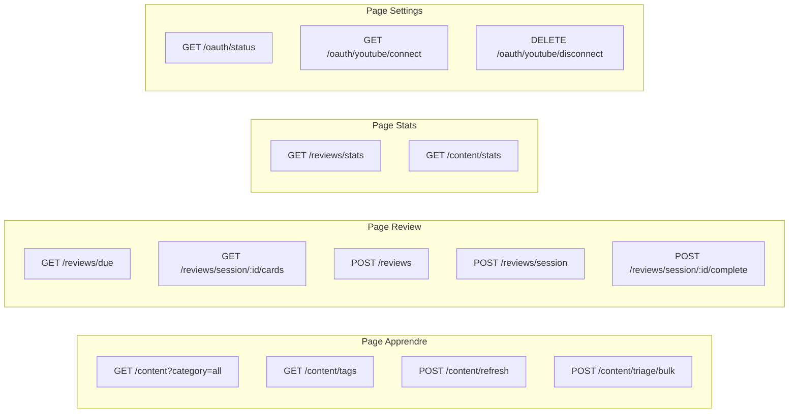
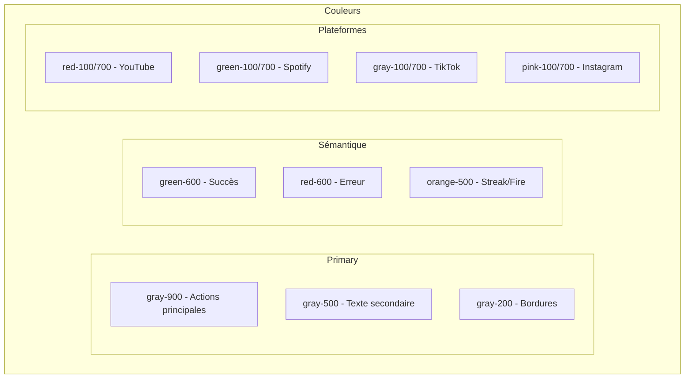

# UX Design Document: Remember

**Project:** Remember - Active Learning from Social Media
**Phase:** Design (BMAD Phase 3)
**Version:** 2.0
**Date:** 2026-01-30
**Author:** UX Designer (BMAD)
**Based on:** PRD v1.1

> **v2.0 Changes:** Refonte complète du flow utilisateur. Navigation simplifiée à 3 pages (Apprendre, Stats, Settings). Suppression des concepts confus (Inbox, Archive, Library). Nouveau système de sélection par mosaïque avec filtres.

---

## 🎯 Design Principles

### 1. **Action First**
L'utilisateur arrive et agit immédiatement. Pas de dashboard passif, pas de stats en premier. La question centrale : "Qu'est-ce que tu veux réviser ?"

### 2. **Simplicité Radicale**
3 pages maximum. Terminologie intuitive. Zéro jargon (plus de "inbox", "archive", "library").

### 3. **Contrôle Total**
L'utilisateur choisit ce qu'il apprend. Sélection par mosaïque visuelle, filtres par plateforme et thème.

### 4. **Focus > Features**
Review session is sacred time. No distractions, no clutter, just questions and answers.

### 5. **Trust Through Quality**
AI-generated quizzes must feel smart and accurate. Bad questions = user trust lost.

---

## 👤 User Personas (UX Focus)

### Persona 1: Sarah (Content Creator)
**Goals:** Archive inspiration, recall techniques quickly
**Pain Points:** Forgets where she saw a specific editing trick
**UX Needs:**
- Fast visual browsing (thumbnails)
- Tag-based filtering
- Quick selection workflow

### Persona 2: Mike (Knowledge Worker)
**Goals:** Integrate with Notion, prove learning progress
**Pain Points:** Never revisits bookmarks
**UX Needs:**
- One-click export to Notion
- Progress dashboard (retention graphs)
- Weekly email summary

### Persona 3: Emma (Lifelong Learner)
**Goals:** Actually retain YouTube tutorials
**Pain Points:** Watches 10 tutorials, can't apply any
**UX Needs:**
- Clear quiz UI (distraction-free)
- Keyboard shortcuts (power user)
- Streak gamification (motivation)

---

## 🧭 Navigation Structure

### Nouvelle Architecture (v2.0)

```
┌─────────────────────────────────────────────────┐
│                                                 │
│  [📚 Apprendre]   [📊 Stats]   [⚙️ Settings]   │
│       ↑                                         │
│   Page principale                               │
│                                                 │
└─────────────────────────────────────────────────┘
```

**3 pages seulement :**

| Page | Description | Icône |
|------|-------------|-------|
| **Apprendre** | Écran principal - sélection et révision | 📚 |
| **Stats** | Progression, streaks, rétention | 📊 |
| **Settings** | Comptes connectés, préférences | ⚙️ |

### Comparaison avec l'ancienne architecture

| Avant (v1.x) | Après (v2.0) |
|--------------|--------------|
| Dashboard | ❌ Supprimé |
| Inbox | ❌ Supprimé |
| Library / Archive | → **Apprendre** |
| Review | → Intégré dans **Apprendre** |
| Stats | ✅ Conservé |
| Settings | ✅ Conservé |

---

## 📦 États du Contenu

### Les 3 états possibles

| Badge | État | Description | Transcrit ? |
|-------|------|-------------|-------------|
| 🆕 | **Nouveau** | Vient d'être synchronisé, pas encore trié | ❌ Non |
| `X quiz` | **Prêt** | Sélectionné par l'user, quiz générés | ✅ Oui |
| `passé` | **Passé** | Ignoré par l'user lors du tri | ❌ Non |

### Cycle de vie d'un contenu

```
┌─────────────────────────────────────────────────────────────┐
│                                                             │
│   Sync YouTube/Spotify/TikTok                               │
│              ↓                                              │
│         🆕 NOUVEAU                                          │
│              ↓                                              │
│   ┌─────────────────────────────┐                          │
│   │   User sélectionne ?        │                          │
│   └─────────────────────────────┘                          │
│         ↓ OUI              ↓ NON                           │
│         │                  │                                │
│   Transcription         PASSÉ                               │
│   Quiz générés          (caché par défaut)                  │
│         ↓                  │                                │
│      PRÊT                  │                                │
│   (X quiz)                 │                                │
│         ↓                  ↓                                │
│   Session de           Peut être                            │
│   révision             réactivé                             │
│                                                             │
└─────────────────────────────────────────────────────────────┘
```

---

## 🗺️ User Flows

### Flow 1: Onboarding (First-Time User)

```
1. User clicks "Get Started" on landing page
   ↓
2. Choose sign-up method:
   - Email + Password
   - Google OAuth (for account)
   ↓
3. Email verification (if email signup)
   ↓
4. Welcome screen:
   "Welcome to Remember! Connect your accounts to start learning."
   ↓
5. Connect YouTube
   [Connect YouTube] button
   ↓
6. YouTube OAuth popup:
   "Remember wants to access your YouTube liked videos"
   User clicks "Allow"
   ↓
7. Success: "✅ YouTube connected!"
   ↓
8. Connect Spotify (optional)
   [Connect Spotify] button
   "Connect Spotify to learn from podcasts (optional)"
   [Skip for now]
   ↓
9. If connected:
   Spotify OAuth popup → User allows
   "✅ Spotify connected!"
   ↓
10. Redirect vers page "Apprendre"
    "Synchronisation en cours..."
    ↓
11. Premier contenu apparaît
    "🎉 3 nouvelles vidéos ! Sélectionne celles que tu veux apprendre."
```

**UX Notes:**
- Total time: <3 minutes to first content
- Direct vers l'action (pas de tutorial forcé)
- L'user voit immédiatement ses vidéos

---

### Flow 2: Sélection et Révision (Core Loop)

```
1. User ouvre l'app
   ↓
2. Page "Apprendre" affichée
   - Mosaïque de contenu (nouveau + prêt)
   - Filtres plateformes et thèmes
   ↓
3. User filtre si besoin
   Ex: [YouTube ✓] [Finance]
   ↓
4. User coche les contenus qu'il veut
   - 🆕 Nouveau → sera transcrit
   - Prêt → sera révisé
   ↓
5. Barre de sélection apparaît
   "2 sélectionnés • 8 quiz prêts"
   [Réviser →]
   ↓
6. User clique "Réviser"
   ↓
7. SI nouveau sélectionné :
   → Transcription lancée en background
   → Notification quand prêt
   ↓
8. SI prêt sélectionné :
   → Session de révision démarre
   ↓
9. Session terminée
   → Retour à "Apprendre"
```

**UX Notes:**
- Un seul écran pour sélectionner ET lancer
- Le tri des nouveaux contenus est implicite (sélection = je veux apprendre)
- Pas de popup de confirmation

---

### Flow 3: Daily Review Session

```
1. User receives daily reminder (9am default)
   Email/Push: "☀️ Good morning! 12 cards are due today."
   ↓
2. User clicks notification ou ouvre l'app
   ↓
3. Page "Apprendre" avec contenus prêts visibles
   ↓
4. User sélectionne ce qu'il veut réviser
   (ou "Tout sélectionner" si pressé)
   ↓
5. Review session loads
   Full-screen interface
   Progress bar at top (0/12 cards)
   ↓
6. First question shown:
   [Question text]
   [4 multiple choice options]
   "Reveal Answer" button
   ↓
7. User thinks, clicks "Reveal Answer"
   ↓
8. Answer shown:
   ✅ Correct answer highlighted
   Explanation (if available)
   Source link: "From: [Video Title]"
   ↓
9. User rates difficulty:
   [Again] [Hard] [Good] [Easy]
   ↓
10. Next card auto-advances (1s delay)
    Progress bar updates: 1/12 → 2/12
    ↓
11. Repeat steps 6-10 until all cards done
    ↓
12. Session complete screen:
    "🎉 Session complete!"
    "12 cards reviewed"
    "11 correct (92%)"
    "Streak: 7 days 🔥"
    [View stats] [Done]
    ↓
13. User clicks "Done" → Returns to "Apprendre"
```

**UX Notes:**
- Full-screen = no distractions
- Keyboard shortcuts: Space = reveal, 1/2/3/4 = difficulty
- Auto-advance keeps momentum
- Session summary celebrates progress

---

### Flow 4: Ignorer un contenu (Passer)

```
1. User sur page "Apprendre"
   ↓
2. Hover sur une carte 🆕 Nouveau
   ↓
3. Bouton "✗ Passer" apparaît
   ↓
4. User clique "Passer"
   ↓
5. Contenu disparaît de la vue
   (passe en état "Passé")
   ↓
6. Pour retrouver : activer filtre "Afficher passés"
```

**UX Notes:**
- Action explicite mais non-bloquante
- Pas de confirmation (réversible)
- Contenus passés accessibles via filtre

---

### Flow 5: Réactiver un contenu passé

```
1. User sur page "Apprendre"
   ↓
2. Active le filtre "Afficher passés"
   ↓
3. Contenus passés apparaissent (grisés)
   ↓
4. User coche un contenu passé
   ↓
5. Sélectionne et clique "Réviser"
   ↓
6. Contenu passe en "Nouveau"
   → Transcription lancée
   → Quiz générés
```

---

## 📱 Wireframes (Text-Based)

### Wireframe 1: Page "Apprendre" (Principal)

```
┌─────────────────────────────────────────────────────────────┐
│ [Logo] Remember                              [↻ Sync] [👤]  │
├─────────────────────────────────────────────────────────────┤
│                                                             │
│  Qu'est-ce que tu veux réviser ?                           │
│                                                             │
│  Plateformes                                                │
│  [YouTube ✓] [Spotify ✓] [TikTok] [Instagram]              │
│                                                             │
│  Thèmes                                                     │
│  [Tous ✓] [Finance] [Productivité] [Philo] [Stoïcisme]     │
│                                                             │
│  Afficher                                                   │
│  [● Actifs]  [○ Passés]                                    │
│                                                             │
├─────────────────────────────────────────────────────────────┤
│                                                             │
│  ┌────────┐ ┌────────┐ ┌────────┐ ┌────────┐              │
│  │ 🆕     │ │ 5 quiz │ │ 🆕     │ │ 3 quiz │              │
│  │ [thumb]│ │ [thumb]│ │ [thumb]│ │ [thumb]│              │
│  │ How to │ │ Stoic  │ │ The 4% │ │ Deep   │              │
│  │ Learn  │ │ Mind...│ │ Rule   │ │ Work   │              │
│  │   ☐    │ │   ☑    │ │   ☐    │ │   ☑    │              │
│  │ [Passer]│ │        │ │ [Passer]│ │        │              │
│  └────────┘ └────────┘ └────────┘ └────────┘              │
│                                                             │
│  ┌────────┐ ┌────────┐ ┌────────┐ ┌────────┐              │
│  │ 8 quiz │ │ 🆕     │ │ 2 quiz │ │ 🆕     │              │
│  │ [thumb]│ │ [thumb]│ │ [thumb]│ │ [thumb]│              │
│  │ Atomic │ │ Podcast│ │ Focus  │ │ Morning│              │
│  │ Habits │ │ #127   │ │ Tips   │ │ Routine│              │
│  │   ☐    │ │   ☐    │ │   ☐    │ │   ☐    │              │
│  │        │ │ [Passer]│ │        │ │ [Passer]│              │
│  └────────┘ └────────┘ └────────┘ └────────┘              │
│                                                             │
│  ... (scroll)                                               │
│                                                             │
├─────────────────────────────────────────────────────────────┤
│                                                             │
│  ☑ 2 sélectionnés • 8 quiz prêts                           │
│                                                             │
│  [Tout sélectionner]                      [Réviser →]      │
│                                                             │
└─────────────────────────────────────────────────────────────┘

Navigation bar (bottom ou sidebar):
[📚 Apprendre]  [📊 Stats]  [⚙️ Settings]
     ●
```

**Key Elements:**
- Question directe "Qu'est-ce que tu veux réviser ?"
- Filtres visibles et accessibles
- Mosaïque visuelle (thumbnails)
- Badge 🆕 pour nouveau, "X quiz" pour prêt
- Bouton "Passer" visible au hover sur les nouveaux
- Checkbox pour sélection multiple
- Barre d'action sticky en bas
- CTA principal "Réviser"

---

### Wireframe 2: Carte Contenu (États)

**État Nouveau :**
```
┌────────────────┐
│ 🆕             │  ← Badge "Nouveau"
│ [Thumbnail]    │
│                │
│ Titre du       │
│ contenu        │
│                │
│ YT • 12 min    │  ← Plateforme + durée
│      ☐         │  ← Checkbox
│                │
│ [✗ Passer]     │  ← Visible au hover
└────────────────┘
```

**État Prêt :**
```
┌────────────────┐
│ 5 quiz         │  ← Nombre de quiz
│ [Thumbnail]    │
│                │
│ Titre du       │
│ contenu        │
│                │
│ YT • #finance  │  ← Plateforme + tag
│      ☑         │  ← Checkbox (sélectionné)
│                │
└────────────────┘
```

**État Passé (si filtre activé) :**
```
┌────────────────┐
│ passé          │  ← Badge grisé
│ [Thumbnail]    │  ← Opacity 50%
│   (grisé)      │
│                │
│ Titre du       │
│ contenu        │
│                │
│ YT • 8 min     │
│      ☐         │
│                │
│ [Réactiver]    │  ← Action au hover
└────────────────┘
```

---

### Wireframe 3: Review Session (Full-Screen)

```
┌─────────────────────────────────────────────────┐
│ Progress: ████████░░░░░░░░░░ 8/12      [X] Exit │
├─────────────────────────────────────────────────┤
│                                                  │
│                                                  │
│         What is the main benefit of              │
│         spaced repetition for learning?          │
│                                                  │
│         ○ It's faster than cramming              │
│         ○ It improves long-term retention  ← Ans │
│         ○ It requires less effort                │
│         ○ It's more fun                          │
│                                                  │
│         [Reveal Answer]  ← Secondary button      │
│                                                  │
│                                                  │
│         Source: "Learning Techniques" (YouTube)  │
│         [View original →]                        │
│                                                  │
└─────────────────────────────────────────────────┘

AFTER REVEAL:

┌─────────────────────────────────────────────────┐
│ Progress: ████████░░░░░░░░░░ 8/12      [X] Exit │
├─────────────────────────────────────────────────┤
│                                                  │
│                                                  │
│         What is the main benefit of              │
│         spaced repetition for learning?          │
│                                                  │
│         ○ It's faster than cramming              │
│         ✓ It improves long-term retention        │
│         ○ It requires less effort                │
│         ○ It's more fun                          │
│                                                  │
│         ✅ Correct!                              │
│         Spaced repetition schedules reviews      │
│         at increasing intervals to maximize      │
│         retention with minimal effort.           │
│                                                  │
│         How did you find this?                   │
│         [Again] [Hard] [Good] [Easy]             │
│                                                  │
│         Source: "Learning Techniques" (YouTube)  │
│         [View original →]                        │
│                                                  │
└─────────────────────────────────────────────────┘
```

**Key Elements:**
- Clean, minimal (no sidebars, no navigation)
- Large, readable text
- Progress bar gives context
- Source link builds trust
- Difficulty rating immediately after reveal

**Keyboard Shortcuts:**
- `Space` = Reveal answer
- `1` = Again, `2` = Hard, `3` = Good, `4` = Easy
- `Esc` = Exit session

---

### Wireframe 4: Page Stats

```
┌─────────────────────────────────────────────────┐
│ [Logo] Remember                         [👤]    │
├─────────────────────────────────────────────────┤
│                                                  │
│  Tes progrès                                     │
│                                                  │
│  ┌──────────┐ ┌──────────┐ ┌──────────┐        │
│  │ 🔥 7     │ │ 📚 87    │ │ 📈 89%   │        │
│  │ jours    │ │ cartes   │ │ rétention│        │
│  │ streak   │ │ apprises │ │          │        │
│  └──────────┘ └──────────┘ └──────────┘        │
│                                                  │
│  Activité cette semaine                          │
│  ┌──────────────────────────────────────────┐   │
│  │  ▁ ▃ ▅ █ ▃ ▅ ▇                           │   │
│  │  L  M  M  J  V  S  D                      │   │
│  └──────────────────────────────────────────┘   │
│                                                  │
│  Répartition par plateforme                      │
│  ┌──────────────────────────────────────────┐   │
│  │  YouTube ████████████████ 65%             │   │
│  │  Spotify ██████████ 25%                   │   │
│  │  TikTok  ████ 10%                         │   │
│  └──────────────────────────────────────────┘   │
│                                                  │
│  Meilleur streak : 14 jours                      │
│  Temps total : 4.2 heures                        │
│                                                  │
└─────────────────────────────────────────────────┘

[📚 Apprendre]  [📊 Stats]  [⚙️ Settings]
                    ●
```

---

### Wireframe 5: Page Settings

```
┌─────────────────────────────────────────────────┐
│ [Logo] Remember                         [👤]    │
├─────────────────────────────────────────────────┤
│                                                  │
│  Paramètres                                      │
│                                                  │
│  ─────────────────────────────────────────────  │
│  Comptes connectés                               │
│                                                  │
│  ┌──────────────────────────────────────────┐   │
│  │ [YT] YouTube              Connecté ✓     │   │
│  │      Dernière sync: il y a 2 min         │   │
│  │      [Synchroniser] [Déconnecter]        │   │
│  └──────────────────────────────────────────┘   │
│                                                  │
│  ┌──────────────────────────────────────────┐   │
│  │ [SP] Spotify              Connecté ✓     │   │
│  │      Dernière sync: il y a 15 min        │   │
│  │      [Synchroniser] [Déconnecter]        │   │
│  └──────────────────────────────────────────┘   │
│                                                  │
│  ┌──────────────────────────────────────────┐   │
│  │ [TT] TikTok               Non connecté   │   │
│  │      [Connecter TikTok]                  │   │
│  └──────────────────────────────────────────┘   │
│                                                  │
│  ─────────────────────────────────────────────  │
│  Préférences de révision                         │
│                                                  │
│  Rappel quotidien : [9:00 ▼]                    │
│  Cartes par session : [20    ]                  │
│                                                  │
│  ─────────────────────────────────────────────  │
│  Profil                                          │
│                                                  │
│  Nom : [Antoine_____________]                   │
│  Email : antoine@example.com                    │
│                                                  │
│  [Déconnexion]                                  │
│                                                  │
└─────────────────────────────────────────────────┘

[📚 Apprendre]  [📊 Stats]  [⚙️ Settings]
                               ●
```

---

### Wireframe 6: Content Detail Modal

```
┌─────────────────────────────────────────────────┐
│ [← Retour]                       [Export ▼]     │
├─────────────────────────────────────────────────┤
│                                                  │
│  📹 How to Learn Anything Faster                 │
│  YouTube • Capturé le 27 Jan 2026                │
│  Tags: #learning #productivity #memory           │
│                                                  │
│  ┌────────────────────────────────────────────┐ │
│  │ [Video Thumbnail]                          │ │
│  │ [▶ Voir sur YouTube]                       │ │
│  └────────────────────────────────────────────┘ │
│                                                  │
│  Transcript (18:42)                              │
│  ▼ [Cliquer pour développer]                    │
│  "The key to learning faster is..."             │
│  [00:00] Introduction                            │
│  [02:15] Spaced repetition explained            │
│  ...                                             │
│                                                  │
│  Quiz générés (5)                                │
│  ┌────────────────────────────────────────────┐ │
│  │ 1. What is the main benefit of spaced...  │ │
│  ├────────────────────────────────────────────┤ │
│  │ 2. Which technique is most effective...   │ │
│  └────────────────────────────────────────────┘ │
│                                                  │
│  [🔄 Régénérer les quiz]                        │
│  [✗ Passer ce contenu]                          │
│                                                  │
└─────────────────────────────────────────────────┘
```

---

## 🎨 Design System

### Color Palette

**Primary (Brand)**
- `#5B47FB` (Purple) - Primary actions, links
- `#4A38D9` (Dark purple) - Hover states
- `#6C5DFF` (Light purple) - Backgrounds, highlights

**Secondary (Accents)**
- `#FF6B6B` (Red) - Errors, "Again" rating
- `#4ECDC4` (Teal) - Success, "Easy" rating
- `#FFA07A` (Orange) - Warnings, "Hard" rating
- `#95E1D3` (Mint) - "Good" rating

**Neutrals**
- `#1A1A1A` (Almost black) - Primary text
- `#4A4A4A` (Dark gray) - Secondary text
- `#9B9B9B` (Medium gray) - Tertiary text
- `#E5E5E5` (Light gray) - Borders
- `#F7F7F7` (Off-white) - Backgrounds
- `#FFFFFF` (White) - Cards, modals

**Semantic**
- Success: `#51CF66` (Green)
- Warning: `#FFD43B` (Yellow)
- Error: `#FF6B6B` (Red)
- Info: `#339AF0` (Blue)

**Content States**
- Nouveau: `#339AF0` (Blue badge)
- Prêt: `#51CF66` (Green badge)
- Passé: `#9B9B9B` (Gray, opacity 50%)

---

### Typography

**Font Stack:**
```css
font-family: 'Inter', -apple-system, BlinkMacSystemFont, 'Segoe UI', sans-serif;
```

**Sizes & Weights:**

| Element | Size | Weight | Line Height |
|---------|------|--------|-------------|
| H1 (Page titles) | 32px | 700 | 1.2 |
| H2 (Section headers) | 24px | 600 | 1.3 |
| H3 (Subsections) | 20px | 600 | 1.4 |
| Body (Default) | 16px | 400 | 1.6 |
| Small (Metadata) | 14px | 400 | 1.5 |
| Button | 16px | 500 | 1.0 |
| Question (Review) | 24px | 500 | 1.5 |

---

### Spacing System

**Base unit:** 8px

| Size | Value | Usage |
|------|-------|-------|
| xs | 4px | Tight spacing |
| sm | 8px | Component padding |
| md | 16px | Default spacing |
| lg | 24px | Section spacing |
| xl | 32px | Page margins |
| 2xl | 48px | Major sections |

**Grid:**
- 4-column grid (mobile), 8-column (tablet), 12-column (desktop)
- Gutter: 16px (mobile), 24px (desktop)
- Max content width: 1200px

---

### Component Library

#### Content Card

```css
/* Card container */
background: white;
border: 1px solid #E5E5E5;
border-radius: 12px;
overflow: hidden;
transition: all 0.2s ease;

/* Hover state */
hover: {
  border-color: #5B47FB;
  box-shadow: 0 4px 16px rgba(0,0,0,0.08);
}

/* Selected state */
selected: {
  border-color: #5B47FB;
  background: rgba(91, 71, 251, 0.05);
}

/* Passed state */
passed: {
  opacity: 0.5;
  filter: grayscale(50%);
}
```

#### Buttons

**Primary (CTA):**
```css
background: #5B47FB;
color: white;
padding: 12px 24px;
border-radius: 8px;
font-weight: 500;
hover: background #4A38D9;
```

**Secondary:**
```css
background: white;
color: #5B47FB;
border: 1px solid #5B47FB;
padding: 12px 24px;
border-radius: 8px;
```

**Ghost (Pass button):**
```css
background: transparent;
color: #9B9B9B;
padding: 8px 16px;
border-radius: 6px;
hover: {
  background: rgba(255, 107, 107, 0.1);
  color: #FF6B6B;
}
```

#### Badges

**Nouveau:**
```css
background: #339AF0;
color: white;
padding: 4px 8px;
border-radius: 6px;
font-size: 12px;
font-weight: 600;
```

**Quiz count:**
```css
background: #51CF66;
color: white;
padding: 4px 8px;
border-radius: 6px;
font-size: 12px;
font-weight: 600;
```

**Passé:**
```css
background: #E5E5E5;
color: #9B9B9B;
padding: 4px 8px;
border-radius: 6px;
font-size: 12px;
```

#### Filter Pills

```css
/* Default */
background: #F7F7F7;
color: #4A4A4A;
padding: 8px 16px;
border-radius: 20px;
border: 1px solid transparent;

/* Active */
background: white;
color: #5B47FB;
border: 1px solid #5B47FB;

/* Hover */
background: #F0EEFF;
```

#### Selection Bar (Sticky Bottom)

```css
position: sticky;
bottom: 0;
background: white;
border-top: 1px solid #E5E5E5;
padding: 16px 24px;
box-shadow: 0 -4px 16px rgba(0,0,0,0.08);
display: flex;
justify-content: space-between;
align-items: center;
```

---

## ♿ Accessibility Guidelines (WCAG 2.1 AA)

### Keyboard Navigation

**Tab Order:**
1. Skip to content link
2. Filters (platforms, themes)
3. Content grid (cards)
4. Selection bar
5. Navigation

**Review Session Shortcuts:**
- `Tab` / `Shift+Tab`: Navigate buttons
- `Space`: Reveal answer
- `1`, `2`, `3`, `4`: Rate difficulty
- `Esc`: Exit session

**Content Selection:**
- `Space`: Toggle card selection
- `Enter`: Open card detail
- `Arrow keys`: Navigate grid

### Focus Indicators

```css
:focus-visible {
  outline: 2px solid #5B47FB;
  outline-offset: 2px;
}
```

### Screen Reader Support

```html
<!-- Card -->
<article aria-label="How to Learn Faster, YouTube, nouveau contenu">
  
  <h3>How to Learn Faster</h3>
  <span aria-label="Nouveau contenu">🆕 Nouveau</span>
  <button aria-label="Sélectionner ce contenu">☐</button>
</article>

<!-- Selection bar -->
<div role="status" aria-live="polite">
  2 contenus sélectionnés, 8 quiz prêts
</div>
```

---

## 🚀 Empty States

### No Content Yet (First Time)

```
┌────────────────────────────────────────┐
│                                        │
│         🎯 Prêt à apprendre ?          │
│                                        │
│   Tu n'as pas encore de contenu.       │
│                                        │
│   Va sur YouTube ou Spotify,           │
│   like des vidéos/podcasts,            │
│   et reviens ici pour réviser !        │
│                                        │
│   [Connecter YouTube]                  │
│   [Connecter Spotify]                  │
│                                        │
└────────────────────────────────────────┘
```

### No Quiz Ready

```
┌────────────────────────────────────────┐
│                                        │
│         ⏳ Pas encore de quiz          │
│                                        │
│   Sélectionne des nouveaux contenus    │
│   pour générer des quiz.               │
│                                        │
│   3 nouveaux contenus disponibles      │
│                                        │
└────────────────────────────────────────┘
```

### All Caught Up

```
┌────────────────────────────────────────┐
│                                        │
│         ✅ Tout révisé !               │
│                                        │
│   Tu as terminé tes révisions.         │
│   Reviens demain pour continuer.       │
│                                        │
│   🔥 Streak: 7 jours                   │
│                                        │
│   [Voir mes stats]                     │
│                                        │
└────────────────────────────────────────┘
```

---

## 📱 Responsive Design

### Breakpoints

| Breakpoint | Width | Layout |
|------------|-------|--------|
| Mobile | < 640px | 2 colonnes, nav bottom |
| Tablet | 640px - 1024px | 3 colonnes, nav bottom |
| Desktop | > 1024px | 4 colonnes, nav sidebar ou top |

### Mobile Specifics

- Navigation bar en bas (fixed)
- Filtres dans un drawer/modal
- Cards plus grandes (2 par ligne)
- Touch targets: minimum 44x44px
- Swipe sur les cartes pour "Passer"

---

## 🔔 Notification Strategy

### Types de notifications

| Type | Message | Fréquence | Canal |
|------|---------|-----------|-------|
| Nouveau contenu | "3 nouvelles vidéos à trier" | À chaque sync | In-app |
| Quiz prêts | "Tes quiz sont prêts !" | Après transcription | In-app + push |
| Rappel quotidien | "12 cartes à réviser" | 1x/jour | Email + push |
| Milestone streak | "🔥 7 jours de streak !" | Aux paliers | In-app + push |

### Smart defaults

- Rappel quotidien à 9h
- Notifications push activées
- Pas de notification pour chaque sync (trop intrusif)

---

## ✅ Design Validation Checklist

**Architecture:**
- [x] 3 pages maximum (Apprendre, Stats, Settings)
- [x] Terminologie claire (Nouveau, Prêt, Passé)
- [x] Flow orienté action

**User Flows:**
- [x] Sélection et révision en un seul écran
- [x] Tri implicite (sélection = je veux apprendre)
- [x] Contenus passés accessibles via filtre

**Wireframes:**
- [x] Page Apprendre avec mosaïque
- [x] Review session full-screen
- [x] Stats et Settings

**Accessibilité:**
- [x] Keyboard navigation
- [x] ARIA labels
- [x] Focus indicators

---

## 🚀 Next Steps

**Completed:**
1. ✅ Product Brief (Business Analyst)
2. ✅ Competitive Research (Creative Intelligence)
3. ✅ PRD (Product Manager)
4. ✅ UX Design v2.0 (UX Designer) - THIS DOCUMENT

**Next:**
- Mettre à jour le code frontend pour refléter le nouveau flow
- Supprimer les pages obsolètes (Dashboard, Inbox, Library)
- Créer la nouvelle page "Apprendre"

---

**Document Status:** ✅ Ready for Implementation
**Owner:** Antoine
**Last Updated:** 2026-01-30

---

## 📐 Architecture Diagrams (Mermaid)

> Les diagrammes ci-dessous fournissent une référence technique complète pour UX/UI Designer.

### Site Map - Navigation Architecture



### Page "Apprendre" - UI Components

```mermaid
flowchart TB
    subgraph LEARN_PAGE["📚 Page Apprendre (LearnPage.tsx)"]
        subgraph HEADER["Header"]
            TITLE["Titre: Qu'est-ce que tu veux réviser ?"]
            SEARCH["🔍 Barre de recherche"]
            SYNC_BTN["🔄 Bouton Sync"]
        end

        subgraph FILTERS["Filtres"]
            PLATFORM_FILTER["Plateformes<br/>[YouTube] [Spotify] [TikTok] [Instagram]"]
            TAG_FILTER["Thèmes<br/>[Finance] [Productivité] [Philo] ..."]
            VIEW_FILTER["Afficher<br/>[Actifs ●] [Archives ○]"]
        end

        subgraph GRID["Grille de Contenu (6 colonnes)"]
            CARD1["📦 ContentCard<br/>🆕 Nouveau<br/>[thumbnail]<br/>Titre<br/>☐ checkbox<br/>[Passer]"]
            CARD2["📦 ContentCard<br/>5 quiz<br/>[thumbnail]<br/>Titre<br/>☑ checkbox"]
            CARD3["📦 ContentCard<br/>Passé (grisé)<br/>[thumbnail]<br/>Titre<br/>[Réactiver]"]
        end

        subgraph SELECTION_BAR["Barre de Sélection (Sticky Bottom)"]
            COUNT["2 sélectionnés • 8 quiz"]
            SELECT_ALL["[Tout sélectionner]"]
            ARCHIVE_BTN["[Archiver]"]
            REVIEW_BTN["[Réviser →]"]
        end
    end

    HEADER --> FILTERS
    FILTERS --> GRID
    GRID --> SELECTION_BAR

    style REVIEW_BTN fill:#4caf50,color:#fff
    style CARD1 fill:#e3f2fd
    style CARD2 fill:#e8f5e9
    style CARD3 fill:#f5f5f5
```



### Review Session Flow



### Content State Machine



### Complete User Flow



### API Endpoints par Page



### Design Tokens Summary


